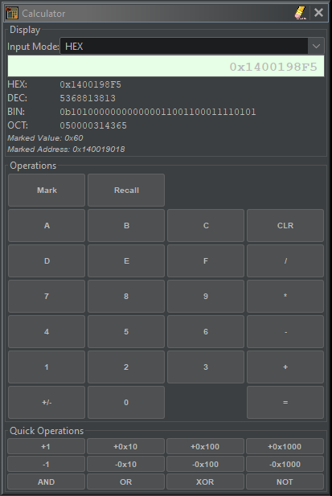
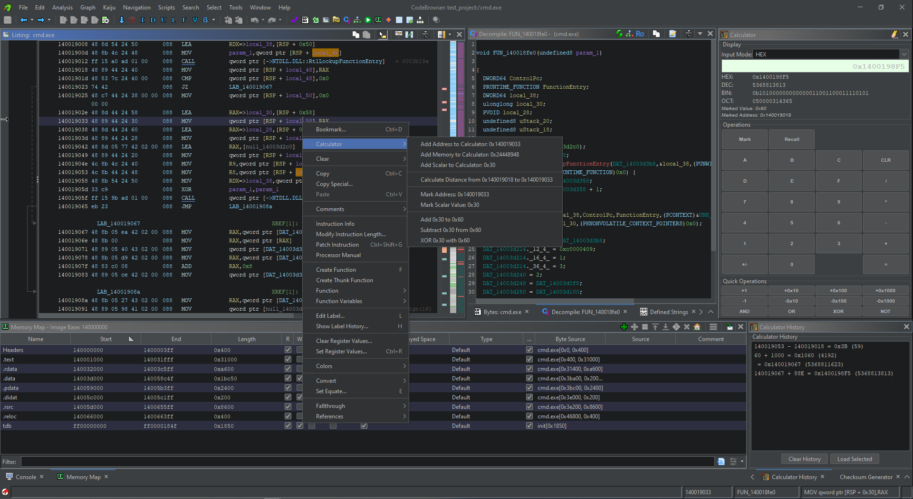

# Ghidra Calculator Plugin

A calculator plugin for Ghidra

## Features

- **Multi-base Display**: Simultaneous hex, decimal, binary, and octal display
- **Input Mode Switching**: Switch between hex/dec/bin/oct input modes
- **Standard Operations**: Addition, subtraction, multiplication, division, modulo
- **Bitwise Operations**: AND, OR, XOR, NOT, NOR, Rotate, Shift
- **Quick Increment/Decrement**: ±1, ±0x10, ±0x100, ±0x1000 buttons
- **Value Marking**: Mark and recall values
- **Real-time Conversion**: See values in all number bases simultaneously
- **History Window**: See previous calculations
  - Double-click to jump to resulting address, if it's a valid address
  - Load result into calculator
- **Context Menu Integration**: Right-click in disassembler to:
  - Add addresses to calculator
  - Add memory values to calculator
  - Add scalar operands to calculator
  - Mark addresses for distance calculation
  - Mark values for comparison operations
  - Perform addition, subtraction, and xor'ing of marked values
  - Add constants from right-click menu in Decompiler window

## Screenshots

## Installation

### Step 1: Install in Ghidra
1. **Open Ghidra**
2. Go to **File → Install Extensions...**
3. Click the **"+"** button (Add Extension)
4. Select the release zip file
5. Click **OK** to install
6. **Restart Ghidra** when prompted

### Step 2: Enable the Plugin
1. After Ghidra restarts, go to **File → Configure → Plugins**
2. Search for **"Calculator"**
3. Check the box next to **"CalculatorPlugin"**
4. Click **OK**

### Step 3: Access the Calculator
1. Go to **Window → Calculator**
2. The calculator window will appear and can be docked anywhere
