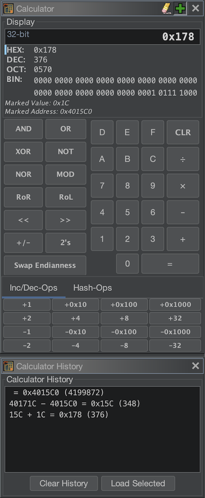
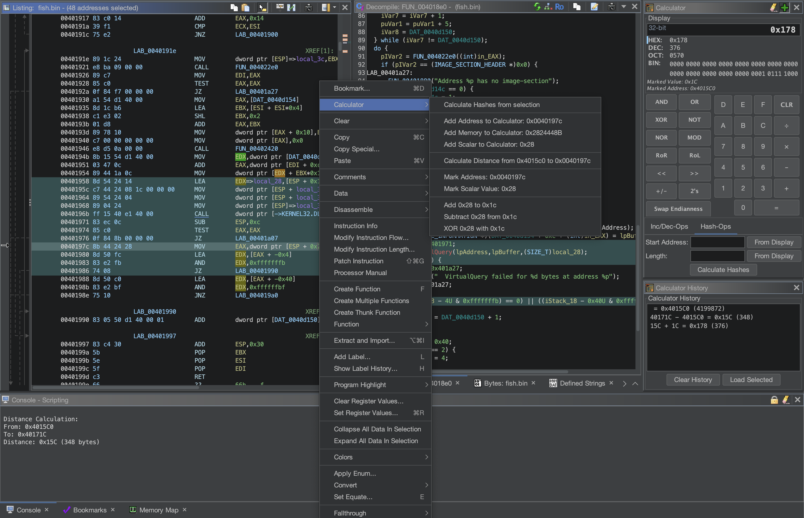

# Ghidra Calculator Plugin

A Calculator plugin for Ghidra that adds a GUI calculator and right-click options for adding addresses, memory, and constant values to the calculator, as well as options for calculating distance between addresses.

**Supports Ghidra 11.3 and later**

## Features

- **Multi-base Display**: Simultaneous hex, decimal, binary, and octal display
- **Clickable Binary Display**: Click on individual bits to flip from 0 to 1 and vice versa
- **Input Mode Switching**: Switch between hex/dec/bin/oct input modes
- **Standard Operations**: Addition, subtraction, multiplication, division, modulo, flip sign, 2's complement conversion, endian swapping
- **Bitwise Operations**: AND, OR, XOR, NOT, NOR, Rotate, Shift
- **Collapsable Extras Panel**: Collapsable extras panel with quick operations and hash calculations
- **Quick Increment/Decrement**: ±1, ±2, ±4, ±8, ±32, ±0x10, ±0x100, ±0x1000 buttons
- **Hash Calculations**: Calculate 28 different hash types for a range of memory
- **Value Marking**: Mark and recall values
- **History Window**: See previous calculations
  - Double-click to jump to resulting address if it's a valid address
  - Load result into calculator
- **Context Menu Integration**: 
  - Right-click in disassembler to:
    - Add addresses to calculator
    - Add memory values to calculator
    - Add scalar operands to calculator
    - Mark addresses for distance calculation
    - Mark values for comparison operations
    - Perform addition, subtraction, and xor'ing of marked values
    - Calculate hashes for a selection of memory
  - Right click in decompiler to:
    - Add constants to calculator
    - Mark constants

Submit new feature ideas as a Github issue and I will implement them!

## Screenshots

## Installation

### Step 1: Install in Ghidra
1. **Open Ghidra**
2. Go to **File → Install Extensions...**
3. Click the **"+"** button (Add Extension)
4. Select the release zip file
5. Click **OK** to install
6. **Restart Ghidra** when prompted

### Step 2: Enable the Plugin
1. After Ghidra restarts, go to **File → Configure → Plugins**
2. Search for **"Calculator"**
3. Check the box next to **"CalculatorPlugin"**
4. Click **OK**
5. The Calculator and history windows should appear, but if not, follow step 3

### Step 3: Access the Calculator
1. Go to **Window → Calculator** and click on **Calculator**
2. Go to **Window → Calculator** and click on **Calculator History**
3. The calculator and history windows will appear and can be docked anywhere
